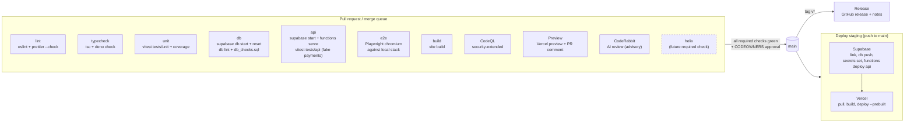

# CI/CD

TaskNest moves money, so nothing reaches `main` without passing every gate below, and every merge to `main` deploys to staging automatically. This page is the map: what runs, when, what it needs, and how to add a new gate (Helix) later.

## Pipeline



## Workflows

| File                                   | Trigger                                               | What it does                                                                                                                                             |
| -------------------------------------- | ----------------------------------------------------- | -------------------------------------------------------------------------------------------------------------------------------------------------------- |
| `.github/workflows/ci.yml`             | `pull_request`, push to `main`, `merge_group`, manual | The seven required jobs: `lint`, `typecheck`, `unit`, `db`, `api`, `e2e`, `build`                                                                        |
| `.github/workflows/codeql.yml`         | PR, push to `main`, `merge_group`, weekly             | CodeQL `javascript-typescript` + `actions`, `security-extended` queries                                                                                  |
| `.github/workflows/preview.yml`        | PR opened/updated                                     | Vercel preview deploy, sticky PR comment with the URL. Skips (green) without secrets                                                                     |
| `.github/workflows/deploy-staging.yml` | push to `main`, manual                                | Supabase migrations + `api` function, then Vercel. Environment `staging`. Each half skips with a notice if its secrets are missing                       |
| `.github/workflows/release.yml`        | tag `v*`                                              | GitHub release with generated notes (categories in `.github/release.yml`) plus the list of migrations in the release. `v1.2.3-rc.1` becomes a prerelease |
| `.github/dependabot.yml`               | weekly (Mon)                                          | npm (dev tooling and runtime grouped, minor/patch) and GitHub Actions (grouped)                                                                          |

Shared plumbing:

- `.github/actions/setup-node-deps`: Node from `.nvmrc` (22), npm cache keyed on `package-lock.json`, `npm ci`.
- `scripts/ci/supabase-env.sh`: turns `supabase status -o env` into `$GITHUB_ENV` (`SUPABASE_URL`, `SUPABASE_ANON_KEY`, `SUPABASE_SERVICE_ROLE_KEY`, `SUPABASE_DB_URL`, `VITE_SUPABASE_*`, `API_BASE_URL`) and masks the keys. Locally: `eval "$(scripts/ci/supabase-env.sh)"`.
- `scripts/ci/wait-for-http.sh`: waits for the Edge Function runtime before tests start.
- `scripts/ci/ensure-supabase-config.sh`: fails fast if `supabase/config.toml` is missing.
- `scripts/ci/check-live-keys.sh`: refuses to deploy with a `sk_live_` Stripe key.
- `scripts/ci/db_checks.sql`: database invariants (below).
- `scripts/ci/coverage-summary.mjs`: coverage table in the job summary.

### Conventions

- Least privilege: every workflow starts at `permissions: contents: read`; jobs opt in to more (`security-events: write` for CodeQL, `pull-requests: write` for the preview comment, `contents: write` for releases).
- Actions are pinned to a major version (`actions/checkout@v7`, `actions/setup-node@v7`, `actions/upload-artifact@v7`, `actions/cache@v6`, `actions/github-script@v9`, `github/codeql-action@v4`, `supabase/setup-cli@v3`, `denoland/setup-deno@v2`). Dependabot bumps them weekly. The Supabase CLI itself is pinned via `SUPABASE_CLI_VERSION` in `ci.yml` and `deploy-staging.yml`, so bump both together.
- Concurrency: a new push to a PR cancels that PR's previous run. Runs on `main` are never cancelled, so every merged commit has a complete result. Staging deploys are serialized and never cancelled mid-migration.
- CI never touches a real payment provider: `PAYMENTS_PROVIDER=fake` for `api` and `e2e`.
- Job ids are the check names. Renaming a job silently breaks branch protection (the ruleset waits forever for the old name), so a rename must update `docs/BRANCH_PROTECTION.md` and `scripts/ci/ruleset-main.json` in the same PR.

## Required checks

| Check       | Source        | Fails when                                                                                                                                                          |
| ----------- | ------------- | ------------------------------------------------------------------------------------------------------------------------------------------------------------------- |
| `lint`      | ci.yml        | ESLint error or any warning (`--max-warnings=0`), or a file not formatted by Prettier. Money rule: `parseFloat` and `toFixed` are banned in `supabase/functions/**` |
| `typecheck` | ci.yml        | `tsc --noEmit` fails for app, domain, tests, e2e. `deno check` fails for `supabase/functions/api/index.ts` (once it exists)                                         |
| `unit`      | ci.yml        | Any Vitest test in `tests/unit` fails. Coverage (v8, scoped to `_shared/domain`) is uploaded as the `coverage-unit` artifact and summarized on the run page         |
| `db`        | ci.yml        | Migrations don't replay cleanly on an empty DB, `supabase db lint` reports errors, or `db_checks.sql` fails                                                         |
| `api`       | ci.yml        | Any test in `tests/api` fails against the local stack + served functions                                                                                            |
| `e2e`       | ci.yml        | Any Playwright test fails. `playwright-report/` and `test-results/` are uploaded as the `playwright-report` artifact                                                |
| `build`     | ci.yml        | `vite build` fails. `dist/` is uploaded as an artifact                                                                                                              |
| `CodeQL`    | code scanning | New CodeQL alerts at or above the ruleset threshold (high security or error)                                                                                        |

### Database invariants (`scripts/ci/db_checks.sql`)

Runs in one transaction that is rolled back, so it is safe to re-run anywhere (`psql "$DB_URL" -v ON_ERROR_STOP=1 -f scripts/ci/db_checks.sql`):

1. RLS is enabled on every table in `public`.
2. No `real`, `double precision` or `money` columns in `public` (money is integer cents).
3. The `ledger_balanced` constraint trigger, the `refund_le_paid` check and the `bookings_no_double_slot` unique index all exist.
4. Ledger: an unbalanced USD txn is rejected, a txn that nets USD against POINTS is rejected, and a balanced txn is accepted. The trigger is deferred, so the check forces it with `SET CONSTRAINTS ... IMMEDIATE`.
5. `refund_le_paid`: refunding exactly the paid amount is allowed, and 1 cent more is rejected, on both update and insert.
6. `bookings_no_double_slot`: a second active booking for the same tasker and `start_at` is rejected, and a canceled booking in that slot is allowed.

Each check was mutation-tested: disabling RLS on one table, dropping the constraint or the index, turning the ledger trigger into a no-op, or adding a `double precision` column each fails the job with a `FAIL <check>` message.

### What the app repo must provide for these jobs

- `supabase/config.toml` (from `npx supabase init`). Without it, `db`, `api` and `e2e` fail with a clear error. As a temporary escape hatch, set `ALLOW_GENERATED_SUPABASE_CONFIG=1` in `ci.yml` `env`.
- `tests/api/**/*.test.ts`, which read `SUPABASE_URL`, `SUPABASE_ANON_KEY`, `SUPABASE_SERVICE_ROLE_KEY` and `API_BASE_URL` from the environment.
- `playwright.config.ts` with a `webServer` that starts the app (for example `npm run dev`). It reads `VITE_SUPABASE_URL` and `VITE_SUPABASE_ANON_KEY`, which CI exports from the local stack. Use `data-testid` selectors.
- Demo users seeded by `supabase/seed.sql` (or a migration) for `api`/`e2e` sign-in.
- The devDependencies in `docs/deps-ci.txt`.

## Secrets and variables

Set these under **Settings → Environments** (`staging`, `preview`) or as repository secrets. Never put a live key anywhere. The deploy workflow refuses `sk_live_`/`rk_live_` keys.

| Name                    | Kind                | Used by                 | Value / notes                                                                                                                         |
| ----------------------- | ------------------- | ----------------------- | ------------------------------------------------------------------------------------------------------------------------------------- |
| `SUPABASE_ACCESS_TOKEN` | secret              | deploy-staging          | Personal access token from supabase.com/dashboard/account/tokens (a bot account is best)                                              |
| `SUPABASE_PROJECT_REF`  | secret              | deploy-staging          | `pfqvqencsbxauafahezw`                                                                                                                |
| `SUPABASE_DB_PASSWORD`  | secret              | deploy-staging          | Database password of the project (for `link` and `db push`)                                                                           |
| `STRIPE_SECRET_KEY`     | secret              | deploy-staging          | Stripe **test** key `sk_test_...`. Pushed to the Edge Function as a Supabase secret. If absent, staging uses `PAYMENTS_PROVIDER=fake` |
| `STRIPE_WEBHOOK_SECRET` | secret              | deploy-staging          | `whsec_...` of the staging webhook endpoint `https://pfqvqencsbxauafahezw.supabase.co/functions/v1/api/webhooks/stripe`               |
| `VERCEL_TOKEN`          | secret              | preview, deploy-staging | Vercel account token                                                                                                                  |
| `VERCEL_ORG_ID`         | secret              | preview, deploy-staging | From `.vercel/project.json` after `vercel link`                                                                                       |
| `VERCEL_PROJECT_ID`     | secret              | preview, deploy-staging | From `.vercel/project.json` after `vercel link`                                                                                       |
| `STAGING_DOMAIN`        | variable (optional) | deploy-staging          | Custom domain to alias each staging deploy to, for example `staging.tasknest.app`                                                     |

The Vite app's own `VITE_SUPABASE_URL` and `VITE_SUPABASE_ANON_KEY` are set in the **Vercel project** (Preview environment), not in GitHub. `vercel pull` fetches them at build time.

CI jobs need **no secrets**. Everything runs against a throwaway local Supabase stack, so fork PRs get the full check suite, and preview deploys skip cleanly because GitHub withholds secrets from forks and Dependabot.

### Secret scanning

Turn on **Settings → Code security**:

- **Secret scanning** and **Push protection**. Push protection blocks pushes that contain Stripe (`sk_live_`, `sk_test_`, `rk_`, `whsec_`), Supabase (`sbp_` access tokens, service-role JWTs) and Vercel tokens before they land. It is free for public repos and needs GitHub Secret Protection for private repos.
- **Dependabot alerts** and **Dependabot security updates**.
- **Code scanning** stays on "Advanced" setup, because `codeql.yml` is the source of truth. Don't also enable Default setup.
- **Private vulnerability reporting**, which `.github/ISSUE_TEMPLATE/config.yml` links to. Update that URL if the repository is not `nizamali1-coder/tasknest`.

CodeRabbit also runs `gitleaks` on every PR diff (see `.coderabbit.yaml`).

If a secret leaks, rotate it first (Stripe dashboard, Supabase tokens, Vercel tokens), then clean history.

## CodeRabbit (AI code review)

1. Install the **CodeRabbit** GitHub App from github.com/apps/coderabbitai (or app.coderabbit.ai → "Add repositories") and grant it this repository only.
2. CodeRabbit is free for public repositories. **Private repositories need a paid plan (Pro)** per reviewing seat. On the free tier it only summarizes private PRs.
3. `.coderabbit.yaml` in the repo root is picked up automatically:
   - auto review on every non-draft PR to `main`, with incremental re-review on new pushes
   - path instructions: `supabase/functions/**` is reviewed for integer cents, balanced ledger txns, idempotency (`Idempotency-Key`, Stripe event dedupe), refund bounds, policy versioning and auth. Migrations, UI, tests and workflows have their own rules
   - request-changes workflow, and chat on (`@coderabbitai` in a PR comment)
4. CodeRabbit is advisory. It is **not** a required check, so an outage or quota limit cannot block merges. The human CODEOWNERS review stays the gate.

## Helix drop-in

Helix (the QA product) joins as one more required check, without touching the existing jobs:

1. Add `.github/workflows/helix.yml`:

   ```yaml
   name: Helix
   on:
     pull_request:
     merge_group:
   concurrency:
     group: helix-${{ github.event.pull_request.number || github.ref }}
     cancel-in-progress: true
   permissions:
     contents: read
     pull-requests: write # if Helix comments its findings
   jobs:
     helix:
       name: helix # <- the required check name
       runs-on: ubuntu-latest
       timeout-minutes: 30
       steps:
         - uses: actions/checkout@v7
         - uses: ./.github/actions/setup-node-deps
         # Same local stack as the api/e2e jobs, so Helix sees real behaviour with fake payments.
         - uses: supabase/setup-cli@v3
           with: { version: 2.117.0 }
         - run: supabase start -x studio,imgproxy,logflare,vector,supavisor
         - run: scripts/ci/supabase-env.sh
         - run: |
             printf 'PAYMENTS_PROVIDER=fake\n' > "$RUNNER_TEMP/functions.env"
             nohup supabase functions serve --env-file "$RUNNER_TEMP/functions.env" > "$RUNNER_TEMP/functions.log" 2>&1 &
             scripts/ci/wait-for-http.sh "$API_BASE_URL" 120 "$RUNNER_TEMP/functions.log"
         # Replace with the Helix action/CLI once published, e.g.:
         # - uses: helix/action@v1
         #   with:
         #     api-key: ${{ secrets.HELIX_API_KEY }}
         #     spec: docs/SPEC.md
         #     base-url: ${{ env.API_BASE_URL }}
   ```

2. Add `HELIX_API_KEY` (if needed) as a repository secret. Remember that fork PRs won't get it, so decide whether Helix skips or fails for forks.
3. Let it run on a few PRs first, as a non-required check.
4. Add `{ "context": "helix", "integration_id": 15368 }` to `required_status_checks` in `scripts/ci/ruleset-main.json`, run `scripts/ci/apply-ruleset.sh`, and add it to the table in `docs/BRANCH_PROTECTION.md`.

Nothing else changes: the other checks, deploys and CODEOWNERS stay as they are.

## Running the checks locally

```bash
npm ci
npx eslint . && npx prettier --check .
npx tsc --noEmit
npx vitest run tests/unit --coverage.enabled
npx supabase start
eval "$(scripts/ci/supabase-env.sh)"
psql "$DB_URL" -v ON_ERROR_STOP=1 -f scripts/ci/db_checks.sql
printf 'PAYMENTS_PROVIDER=fake\n' > /tmp/functions.env
npx supabase functions serve --env-file /tmp/functions.env &
npx vitest run tests/api
npx playwright install chromium && npx playwright test
npx vite build
```
